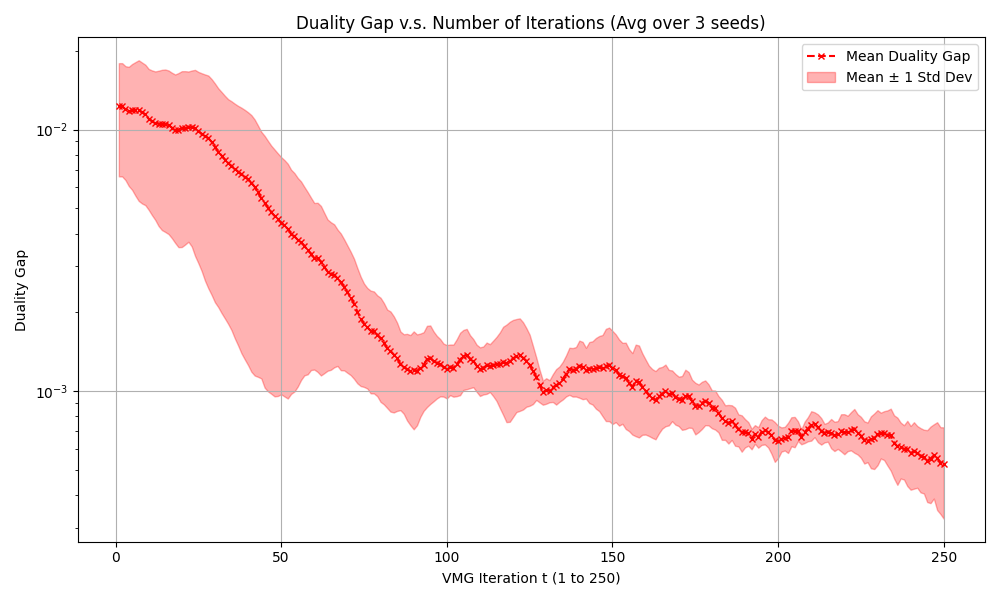

# VMG

We provide a complete Python implementation and experimental results of our Algorithm 2 on randomly generated MDPs for two-player zero-sum Markov games under the linear mixture model setting. In the experiments:
1. We adopt linear mixture model (c.f. Assumption 4): we randomly generate the feature function $\phi$ and $\theta^\star$ - the underlying parameter for the transition kernel of the MDP (i.e., $P_h(s'|s,a) = \phi_h(s,a,s')^\top \theta_h^\star$) and the reward funcion.

2. We solve line 4 (find NE of the game) in our Algorithm 2 using OMWU - Algorithm 2 in [Cen et al., 2022](https://arxiv.org/pdf/2210.01050). We compute $f_t$ in line 5 by minimizing the objective with 100 Adam steps.

Below is the Duality gap v.s. Number of iterations (Averaged over 3 random seeds).

Our empirical results demonstrate that the duality gap decreases significantly over iterations, confirming that VMG finds a good Nash Equilibrium approximation within a reasonable number of iterations. 
